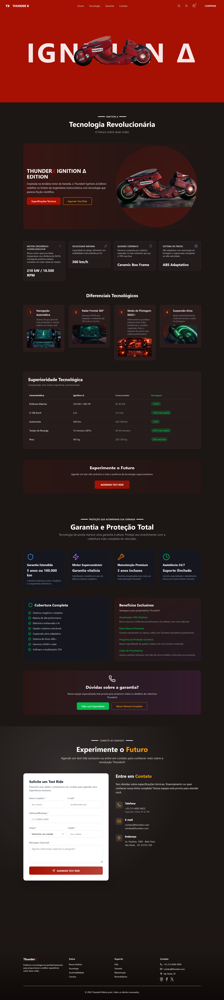

# 🏍️ ThunderX - Landing Page

<p align="center">
  
  
  
  
  
  
</p>

<p align="center">
  
</p>

> Uma landing page imersiva e moderna para o lançamento da moto **IGNITION Δ**.

## 📋 Visão Geral

ThunderX é uma landing page desenvolvida com tecnologias modernas para apresentar o lançamento de uma motocicleta. O site apresenta um design com visualização 3D do modelo, destacando recursos tecnológicos, especificações, garantia e um formulário de contato e compra.

## 📸 Preview

<div align="center">
  
</div>

## ✨ Características

- **Visualização 3D**: Modelo 3D da moto IGNITION renderizado com Three.js e React Three Fiber
- **Design Responsivo**: Totalmente adaptado para dispositivos móveis e desktops
- **Animações Suaves**: Efeitos de animação com Framer Motion
- **Seções Temáticas**:
    - Header com navegação
    - Hero section com modelo 3D
    - Seção de tecnologia e especificações
    - Seção de garantia
    - Seção de contato
    - Footer com links
- **Página de Compra**: Formulário multi-step interativo com validação de dados
- **Seção de Contato**: Formulário com estados e cidades dinâmicos e máscara de telefone
- **Validação Robusta**: Schema de validação com Zod para CPF, CEP, cartão, etc.
- **Integração de Serviços**: Busca de endereço por CEP (ViaCEP integration)

## 🛠️ Stack Tecnológico

### Frontend

- **[Next.js](https://nextjs.org/)** 16.1.6 - Framework React full-stack
- **[React](https://react.dev/)** 19.2.3 - Biblioteca UI
- **[TypeScript](https://www.typescriptlang.org/)** - Tipagem estática
- **[Tailwind CSS](https://tailwindcss.com/)** 4 - Estilização utilitária

### Gráficos 3D

- **[Three.js](https://threejs.org/)** 0.182.0 - Engine 3D
- **[React Three Fiber](https://docs.pmnd.rs/react-three-fiber/)** 9.5.0 - Renderer React para Three.js
- **[Drei](https://github.com/pmndrs/drei)** 10.7.7 - Utilidades para React Three Fiber

### Animações

- **[Motion](https://www.motion.dev/)** 12.34.0 - Animações modernas

### Formulários e Validação

- **[React Hook Form](https://react-hook-form.com/)** - Gerenciamento eficiente de formulários
- **[Zod](https://zod.dev/)** - Validação de schema TypeScript-first

### Utilitários

- **[Lucide React](https://lucide.dev/)** - Ícones SVG
- **ESLint** - Linting de código
- **Prettier** - Formatação de código

## 📁 Estrutura do Projeto

```
src/
├── app/
│   ├── buy/
│   │   ├── page.tsx          # Página de compra (formulário multi-step)
│   ├── globals.css           # Estilos globais e variáveis de cor
│   ├── layout.tsx            # Layout principal
│   └── page.jsx              # Página home
├── components/
│   ├── contactSection/       # Seção de contato
│   ├── footer/               # Rodapé
│   ├── header/               # Cabeçalho e navegação
│   ├── loading/              # Estados de carregamento (Loading.jsx, SceneLoader.jsx)
│   ├── models/               # Modelos 3D (Ignition.jsx)
│   ├── portfolioLink/        # Link para portfólio do desenvolvedor
│   ├── renderModel/          # Renderizador 3D com Canvas
│   ├── technologySection/    # Seção de tecnologia e especificações
│   └── warrantySection/      # Seção de garantia e proteção
├── hooks/
│   ├── useBuyForm.ts         # Hook para gerenciar formulário de compra multi-step
│   ├── useContactForm.ts     # Hook para seção de contato (estados/cidades + máscaras)
├── schemas/
│   └── buyFormSchema.ts      # Schema de validação Zod para compra
├── services/
│   ├── getAddressByCep.ts    # Serviço de busca de endereço por CEP
│   └── getLocations.ts       # API mock para estados e cidades
└── utils/
    ├── cn.ts                 # Utilidade para merge de classes Tailwind
    └── masks.ts              # Máscaras de entrada para CPF, CEP, telefone, cartão
```

## 📝 Formulários

Este projeto utiliza dois formulários distintos, cada um encapsulado em seu hook para facilitar reutilização e testes.

### Formulário de Compra

#### `useBuyForm.ts` – Hook de Compra

Gerencia todo o fluxo de checkout:

- **Gerenciamento de Steps**: Navegação entre 3 etapas (informações pessoais, endereço, pagamento)
- **Validação com Zod**: Integração com `@hookform/resolvers` para validação em tempo real
- **Máscaras de Entrada**: Aplicação automática de máscaras para CPF, telefone, CEP, cartão e validade
- **Busca de Endereço**: Integração com ViaCEP para auto-completar endereço pelo CEP
- **Estados**: Controle de carregamento, sucesso e erros

#### `buyFormSchema.ts` – Schema Zod

Define regras para cada campo do pedido:

- **Pessoais**: nome, email, telefone, CPF
- **Endereço**: CEP, rua, número, complemento, bairro, cidade, estado
- **Pagamento**: número do cartão, nome, validade (MM/AA), CVV
- **Configuração**: modelo (Ignition‑delta/Pro), cor e aceite de termos

#### `getAddressByCep.ts` – Serviço

Roda consulta ao ViaCEP assim que o CEP é preenchido.

### Formulário de Contato

#### `useContactForm.ts` – Hook de Contato

Utilizado em `ContactSection`:

- Validação Zod dos campos obrigatórios
- Máscara de telefone compartilhada com o checkout
- Dropdown de **estados / cidades** alimentado por `getLocations.ts`
- Feedback visual de envio e limpeza após sucesso

#### `getLocations.ts` – Serviço de Localidades

Retorna lista de estados e, ao selecionar um deles, as cidades correspondentes.

### Utilitários Reutilizados

Funções de máscara e helpers estão em `src/utils/masks.ts` e servem ambos formulários para manter consistência de UX.

Quando o usuário digita o CEP, o endereço é preenchido automaticamente.

#### `masks.ts` - Máscaras de Entrada

Funções utilitárias para formatar entrada do usuário:

- `maskCPF`: XXX.XXX.XXX-XX
- `maskPhone`: (XX) XXXXX-XXXX
- `maskCEP`: XXXXX-XXX
- `maskCreditCard`: XXXX XXXX XXXX XXXX
- `maskCardExpiry`: MM/AA

## 🚀 Como Começar

### Pré-requisitos

- Node.js 18+ ou superior
- npm, yarn, pnpm ou bun

### Instalação

1. Clone o repositório:

```bash
git clone https://github.com/RiuriII/ThunderX.git
cd Thunderx
```

2. Instale as dependências:

```bash
npm install
# ou
yarn install
# ou
pnpm install
```

3. Execute o servidor de desenvolvimento:

```bash
npm run dev
# ou
yarn dev
```

4. Abra [http://localhost:3000](http://localhost:3000) no navegador para ver o resultado.

## 📝 Scripts Disponíveis

- `npm run dev` - Inicia o servidor de desenvolvimento
- `npm run build` - Cria a build otimizada para produção
- `npm start` - Executa a aplicação em produção
- `npm run lint` - Executa verificação de linting

## 🎨 Customização

### Cores e Temas

As cores da aplicação são definidas via Tailwind CSS. Edite elas em `globals.css` para personalizar as cores.

## 🌐 Demo

<div align="center">
  <h3>
    <a href="https://thunder-x.vercel.app/" target="_blank">
      🚀 Acesse a Demo → Ignition Δ
    </a>
  </h3>
  
  <p>
    
    <br />
    <em>Escaneie para acessar no celular</em>
  </p>
</div>

## 📄 Licença

Este projeto está sob licença MIT. Sinta-se livre para usar e modificar conforme necessário.

## 👨‍💻 Contribuições

Contribuições são bem-vindas! Sinta-se livre para abrir issues e pull requests.
